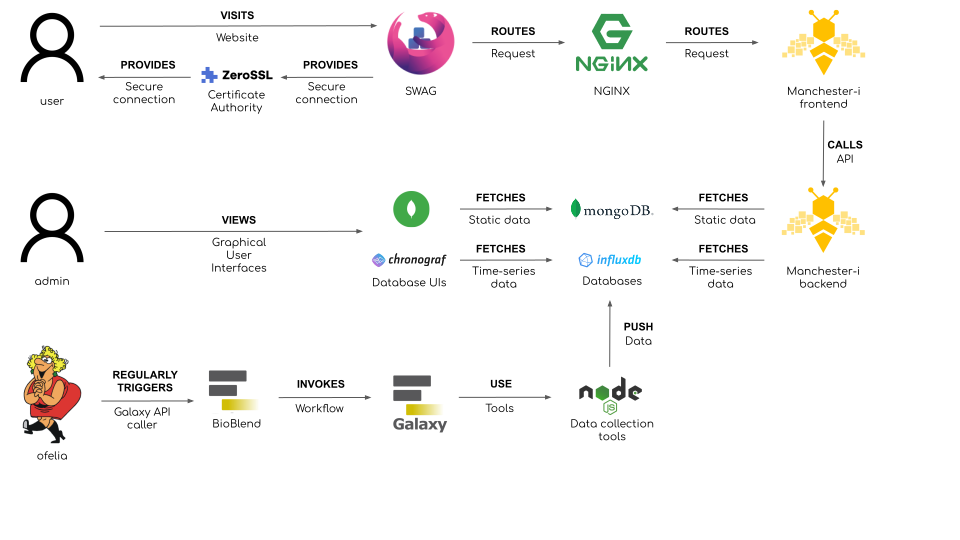

# Explanation of structure of Manchester-I deployment #

When a user visits the Manchester-i website, they are served a secure connection to the Manchester-i frontend container, via an Nginx reverse proxy managed by a convenience container named SWAG which handles certificate acquisition on startup and routing thereafter.

The Manchester-i frontend container is able to display data to the user by making API calls to the Manchester-i backend container. This container has connections to containers housing Mongodb and Influxdb respectively. 

Additionally, an administrator user may access graphical user interface to both databases via web-based UIs containers, Mongo-Express and Chronograf respectively.

Finally, a container named Oelia is used to regularly schedule events. When these events occur, containers 'labelled' as of interest to Ofelia have specified commands run in them. In this way, calls to the Galaxy API (managed by the library BioBlend) are made regularly. 

In the current configuration, the Galaxy API is used to trigger a workflow which utilises a set of data gathering tools (written in NodeJS) to import data from sensors, which is then pushed to the Influxdb instance.

